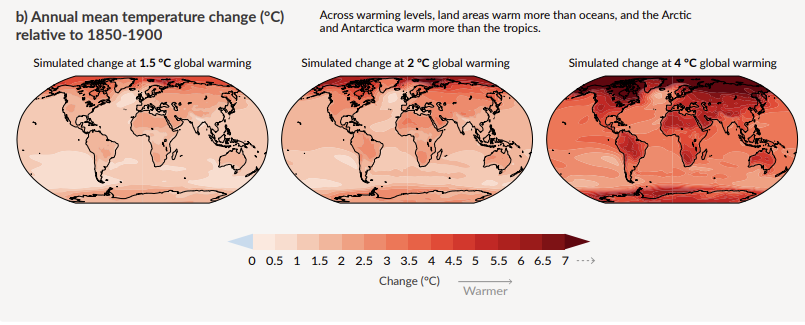
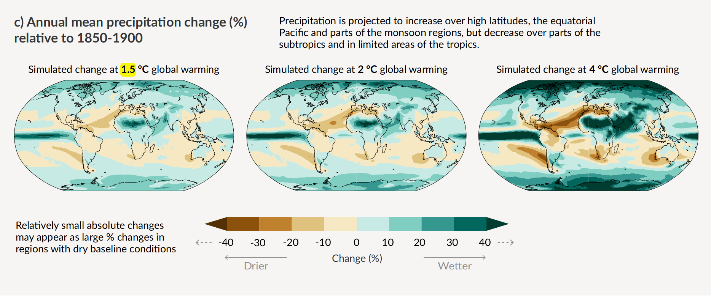
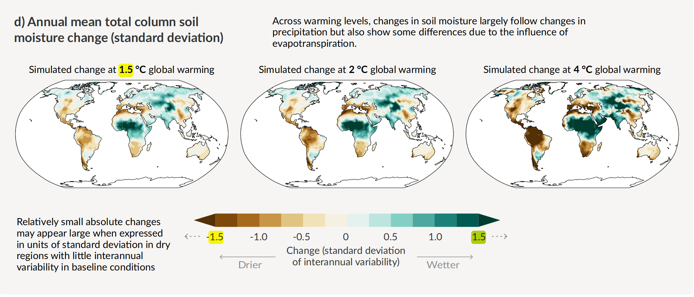
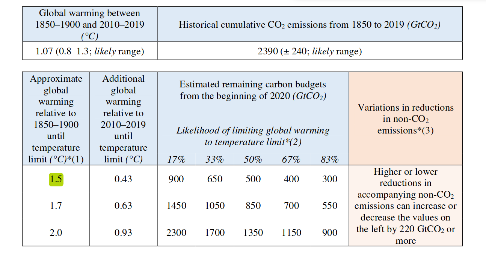

## Warum ist 1,5° eine wichtige Schwelle?

## AR6 zum 1,5°-Ziel

Verweise auf den 1.5 Grad-Report

Wir haben an Land dieses Ziel bereits überschritten: 

> Each of the last four decades has been successively warmer than any decade that preceded it since 1850. Global surface temperature8 in the first two decades of the 21st century (2001-2020) was 0.99 [0.841.10] °C higher than 1850-19009. Global surface temperature was 1.09 [0.95 to 1.20] °C higher in 20112020 than 1850–1900, with larger increases over land (1.59 [1.34 to 1.83] °C) than over the ocean (0.88 [0.68 to 1.01] °C). The estimated increase in global surface temperature since AR5 is principally due to further warming since 2003–2012 (+0.19 [0.16 to 0.22] °C). Additionally, methodological advances and new datasets contributed approximately 0.1ºC to the updated estimate of warming in AR610. [@ipccSummaryPolicymakers2021, p.5]

Visualisierung der bisherigen Entwicklung:

Slide 6 von @SBSTANovember20212021 

Original: https://commons.wikimedia.org/wiki/File:IPCC_AR6_WGI_SPM_obr1.svg

Unterschiedliche Faktoren sind für den Strahlungsantrieb verantwortlich, vor allem CO2:

Fig SPM 2. @AR6WGIbasicslidedeck2021

Man muss 6500, aber eher 125.000 Jahre zurückgehen, um in der Erdgeschichte die aktuellen Temperaturen wiederzufinden.

> Global surface temperature has increased faster since 1970 than in any other 50-year period over at least the last 2000 years (high confidence). Temperatures during the most recent decade (2011–2020) exceed those of the most recent multi-century warm period, around 6500 years ago13 [0.2°C to 1°C relative to 18501900] (medium confidence). Prior to that, the next most recent warm period was about 125,000 years ago when the multi-century temperature [0.5°C to 1.5°C relative to 1850–1900] overlaps the observations of the most recent decade (medium confidence). [@ipccSummaryPolicymakers2021, p.9]

Es ist sehr wahrscheinlich, dass nicht nur 1,5, sondern auch 2° bis zum Ende des Jahrhunderts überschritten werden:

> Global surface temperature will continue to increase until at least the mid-century under all emissions scenarios considered. Global warming of 1.5°C and 2°C will be exceeded during the 21st century unless deep reductions in CO2 and other greenhouse gas emissions occur in the coming decades. [@ipccSummaryPolicymakers2021, p.17]

> Compared to 1850–1900, global surface temperature averaged over 2081–2100 is very likely to be higher by 1.0°C to 1.8°C under the very low GHG emissions scenario considered (SSP1-1.9), by 2.1°C to 3.5°C in the intermediate scenario (SSP2-4.5) and by 3.3°C to 5.7°C under the very high GHG emissions scenario (SSP5-8.5)24. The last time global surface temperature was sustained at or above 2.5°C higher than 1850–1900 was over 3 million years ago (medium confidence).  [@ipccSummaryPolicymakers2021, p.17]

Wie die Tabelle oben auf S.18 zeigt, werden wir mit großer Wahrscheinlichkeit die 1,5° spätestens 2040 erreicht haben, und bei fast allen Szenarios außer dem niedrigsten bis 2100 deutlich übertreffen. [@ipccSummaryPolicymakers2021, p.18]

> Global warming of 1.5°C relative to 1850-1900 would be exceeded during the 21st century under the intermediate, high and very high scenarios considered in this report (SSP2-4.5, SSP3-7.0 and SSP5-8.5, respectively). Under the five illustrative scenarios, in the near term (2021-2040), the 1.5°C global warming level is very likely to be exceeded under the very high GHG emissions scenario (SSP5-8.5), likely to be exceeded under the intermediate and high GHG emissions scenarios (SSP2-4.5 and SSP3-7.0), more likely than not to be exceeded under the low GHG emissions scenario (SSP1-2.6) and more likely than not to be reached under the very low GHG emissions scenario (SSP1-1.9)27. Furthermore, for the very low GHG emissions scenario (SSP1-1.9), it is more likely than not that global surface temperature would decline back to below 1.5°C toward the end of the 21st century, with a temporary overshoot of no more than 0.1°C above 1.5°C global warming.  [@ipccSummaryPolicymakers2021, p.18]

Eine fast sicher Folge werden so noch nie dagewesene Extremereignisse sein.

> There will be an increasing occurrence of some extreme events unprecedented in the observational record with additional global warming, even at 1.5°C of global warming. Projected percentage changes in frequency are higher for rarer events (high confidence). [@ipccSummaryPolicymakers2021, p.19]

In vielen Gebieten werden die Temperaturen deutlich höher sein, am meisten in der Arktis (Fig. SPM 5)

Schon bei 1,5 Grad nehmen Niederschläge regional um 20, 30 und mehr Prozent zu, und die Bodenfeuchtigkeit kann um das Anderhalbfache zu- oder abnehmen. (Fig. SPM 5., c) und d) )

Wie heiss es wird, hängt von den Gesamtemissionen ab, nicht vom aktuellen Ausstoss.

Welche kumulativen Emissionen entsprechen 0,1°

Das für

 1,5° zur Verfügung stehende CO2-Budget liegt bei etwa 400 Gigatonnen, gerechnet ab 2020 (siehe Tabelle 2, p.38)
 
 
 
 
 
 
 

Siehe zur Erläuterung u.a. 

WGI

[@hensonKeyTakeawaysNew2021]

Extremereignisse werden zunehmen (siehe Figure SPM6). Zunehmen werden auch die *compound events*, die sich bei 2° dramatisch steigern würden. 

Welche kumulativen Emissionen entsprechen 0,1° (siehe p. 36)

## Bedeutung von 1,5° für Österreich und Graz 