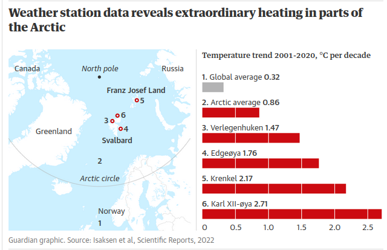

[[2022-06-16-17-13-42]] [Prozess: Erhitzung der Arktis](2022-06-16-17-13-42.html) 

Eine neue Studie [@isaksenExceptionalWarmingBarents2022] zeigt, dass sich die nördliche Barents-See noch stärker erwärmt als der Rest der Arktis. Ein Grund dafür ist offenbar ein Rückkoppelungs-Effekt: Wasser reflektiert weniger Wärmestrahlen als Eis. Bericht im Guardian: @carringtonNewDataReveals2022. Es wird vermutet, dass die Erhitzung dieses Gebiets Extremwetter-Ereignisse in Europa und Nordamerika verstärkt. Es handelt sich um die bisher stärksten beobachteten Erwärmungsraten.

> The result was a high-quality set of surface air temperature measurements from 1981 to 2020. The researchers concluded: “The regional warming rate for the Northern Barents Sea region is exceptional and corresponds to 2 to 2.5 times the Arctic warming averages and 5 to 7 times the global warming averages.”

 

