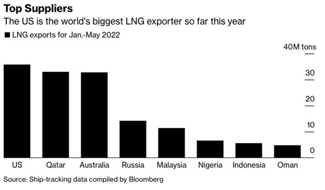
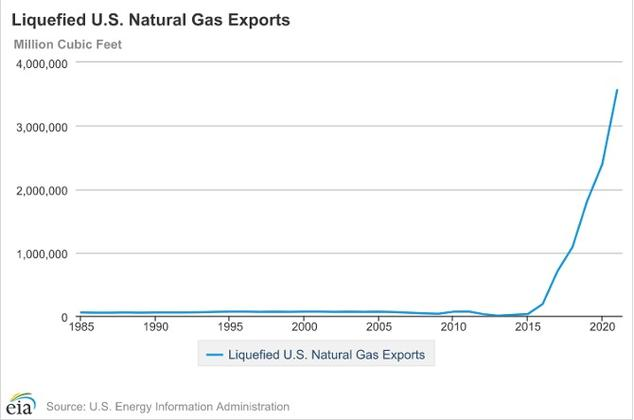

---
title: Steigende Flüssiggasexporte verstoßen gegen das Pariser Abkommen
---

[[2022-06-16-16-04-10]] [Prozess: Ausbeutung zusätzlicher fossiler Brennstoffvorkommen](2022-06-16-16-04-10) 

Überblick zu den LNG-Exporten nach dem Ausbruch des Ukraine-Kriegs [@shuklaGrowthLNGExports2022], bezieht sich auf eine ausführliche Analyse derselben Autor:innen [@shuklaRiskyBusinessSurging2022].

Ökologische, geopolitische und finanzielle/wirtschaftliche Faktoren greifen ineinander.

 

## Die Steigerung der LNG-Produktion vergößert die Emissionen insgesamt

## Die Abhängigkeit vom volatilen LNG-Markt macht die Risiken für die Importeure größer

* Reiche Länder müssen wesentlich mehr für Energie aufwenden
* Arme Länder können die gestiegenen Gaspreise möglicherweise gar nicht mehr bezahlen

## Risiken von Stranded Assets