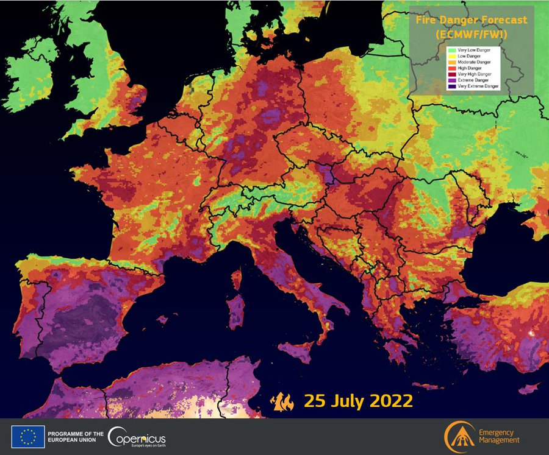

[[2022-07-03-18-36-28]] [Prozess: Zunahme von Weltbränden](2022-07-03-18-36-28.html) [[2022-07-03-18-48-16]] [Juni 2022](2022-07-03-18-48-16.html)

[[2022-07-25-14-57-08]] [Ereignis: Waldbrände in Südeuropa, Juni und Juli 2022](2022-07-25-14-57-08.html) 

CopernicusEU@respublicae.eu - In June 2022, #Spain 🇪🇸 faced a severe #wildfire crisis

@CopernicusEMS has mapped more than 48,000 ha of vegetation affected by the #fires 🔥

⬇️The burn scar caused by a wildfire that broke out near Pamplona (#IFLegarda) is visible in the #Sentinel2 🇪🇺🛰️image acquired on 2 July 

🐦🔗: https://nitter.eu/CopernicusEU/status/1543502197303943174

