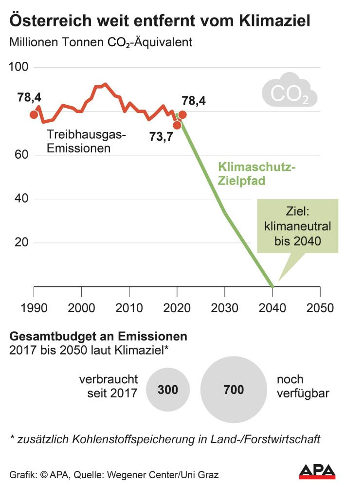

Bei der Dekarbonisierung ist Österreich nach wie vor ein Schlusslicht. Die Emissionen sind exakt so hoch wie 1990. Die EU hat es insgesamt wenigstens auf 25% Reduktion der Emissionen seit 1990 gebracht.

> Es war nur ein kurzer Dämpfer, den das erste Corona-Jahr in Österreichs Emissionsbilanz hinterlassen hat. Nach dem pandemiebedingten Einbruch 2020 wurde im Vorjahr wieder deutlich mehr emittiert: Laut Berechnungen des Wegener Center der Uni Graz sind die Emissionen um 6,5 Prozent gestiegen – und befinden sich damit auf dem gleichen Niveau wie 1990. Im Jahr 2020 waren sie um 7,5 Prozent eingebrochen. 

> Eigentlich sollte die Emissionskurve längst nach unten deuten, zeigt sich Kirchengast besorgt: Die Europäische Union konnte im Vergleich zu Österreich ihre Emissionen seit 1990 im Schnitt um rund 25 Prozent senken. Einzelne Länder brachten gar ein Minus von mehr als 30 Prozent zustande. In Österreich hingegen sei der strukturelle Trend bei den Emissionen weiterhin nicht gebrochen, kritisiert der Wissenschafter. [@lauferSchwerwiegendeStrategischeFehler2022] 

> Österreichs Ziel, bis 2040 klimaneutral zu werden, rückt zunehmend in die Ferne: Bis zum Jahr 2030 etwa sollte der nationale Ausstoß auf rund 35 Millionen Tonnen CO2-Äquivalente sinken, zum Vergleich: Im Vorjahr wurden 78,4 Millionen Tonnen CO2 in die Luft geblasen. Dennoch sei die Netto-Null noch erreichbar, erklärt Kirchengast. Dafür sei eine jährliche Emissionsreduktion von 4,5 Millionen Tonnen bis 2030 und anschließend von 3,4 Millionen Tonnen bis 2040 notwendig. "Klimaneutralität 2040 wird jedenfalls nicht an der EU scheitern, sondern wenn, dann an den strategischen politischen und wirtschaftlichen Fehlern in Österreich."