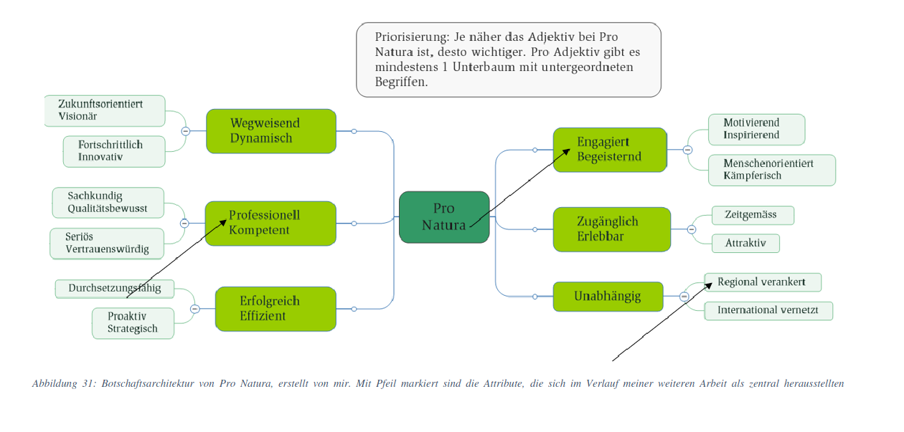
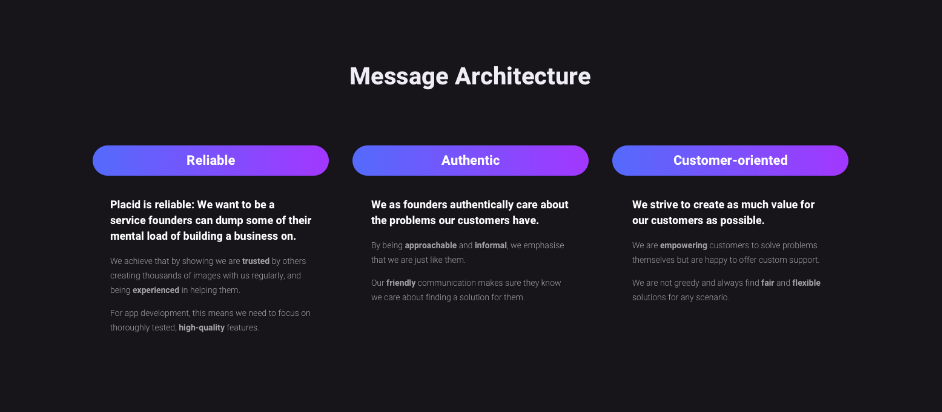
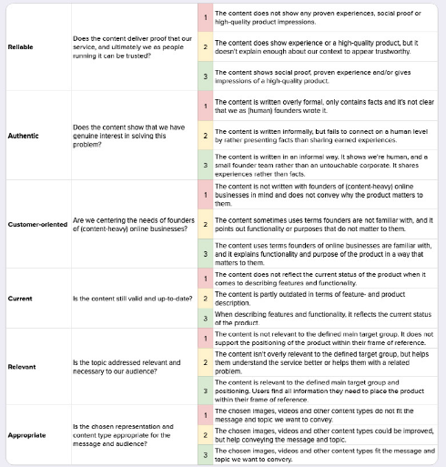
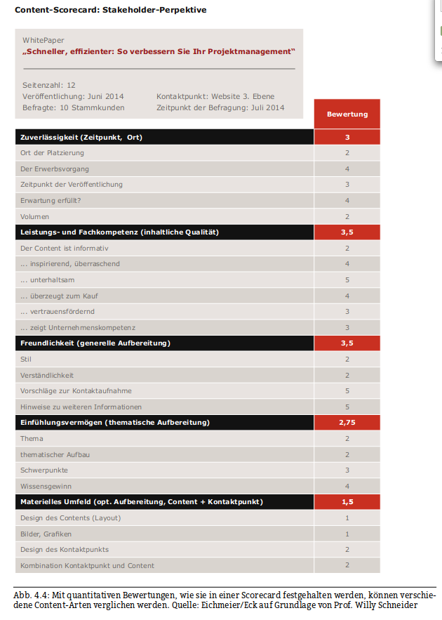

"Botschaftsarchitektur" wird in der Contentstrategie einerseits im mehr oder weniger alltagssprachlichen Sinn verwendet, und andererseits als ein Terminus technicus – wie übrigens viele Ausdrücke einschließlich des Ausdrucks "Contentstrategie" selbst.

Die spezielle, technische Bedeutung von "Botschaftsarchitektur" geht auf die amerikanische Contentstrategin Margot Bloomstein zurück, die die von ihr vertretene "markenorientierte Contentstrategie" um ihr Konzept der Botschaftsarchitektur herum entwickelt und es in ihrem ersten Buch [@bloomsteinContentStrategyWork2012] erläutert hat. Margot Bloomstein hat dieses Verfahren unter anderem für die Firmen Mini und Al-Jazeera in den USA verwendet. Ihre Methoden wurden in der Praxis oft und erfolgreich übernommen, z.B. für viele Projekte von Studierenden des Grazer Studiengangs Content-Strategie. 

Ziel einer Botschaftsarchitektur ist es, die Inhalte einer Organisation um zentrale Botschaften herum zu organisieren, die von jedem Inhalt vermittelt bzw. mitvermittelt werden. Zwischen diesen Botschaften besteht eine klare Hierarchie, ihre Zahl ist begrenzt (meist auf etwa drei), und auf die Kommunikation von Inhalten, die diese Botschaften nicht repräsentieren, wird strikt verzichtet. 

Eine Botschaftsarchitektur ist relevant, damit die Kommunikation einer Organisation angesicht der begrenzten Aufmerksamkeit der Rezipientinnen und angesichts begrenzter Möglichkeiten für die Produktion und Kommunikation von Inhalten so fokussiert wie möglich erfolgt und damit strategische Ziele unterstützen kann. Sie dient also dazu, so ökonomisch wie möglich zu kommunizieren. 

Die Kernbotschaften sind in der Regel Übersetzungen von Markenqualitäten in kommunikative Inhalte. Sie bestimmen, wie die Organisation von ihren Adressat:innen wahrgenommen werden will. Deshalb werden die Botschaften meist durch Adjektive beschrieben, wie z.B. in drei dieser vier Kernbotschaften für ein College [@wittenbrinkConfabHigherEd2013]:

> „We elevate the distinct and whole person“

> „Rigoros, Passionate, Intense“

> „Welcoming“

> „Engaged“

Um eine Botschaftsarchitektur zu entwickeln, verwendet man im Anschluss an Margot Bloomstein meist ein Cardsorting-Verfahren – beschrieben z.B. in *Wie Card-Sorting die Markenidentität stärkt* [@siegerWieCardSortingMarkenidentitat2019]. Die Kommunikationsverantwortlichen einer Organisation ordnen dabei ein Kartenset mit Begriffen in drei Stapel: 

(1) Wie sind wir? 
(2) Wie wollen wir sein? 
(3) Wie wollen wir nicht sein? 

In einem zweiten Schritt werden dann aus den Karten der Stapel 1 und 2 die wichtigsten Begriffe ausgewählt; andere können ihnen zur Erläuterung zugeordnet werden. Den Teilnehmer:innen steht es frei, eigene Karten hinzuzufügen. Genauso wichtig wie das Ergebnis ist der Prozess der Formulierung einer Botschaftsarchitektur. Der Prozess wird von einer Contentstrategin oder einem Contenstrategen moderiert, die eigentliche Erstellung der Botschaftsarchitektur ist aber Aufgabe der Vertreter:innen der Organisation. Margot Bloomstein bietet ein eigenes Kartenset für eine solches Card Sorting an <http://cards.appropriateinc.com/>. Die österreichische Content-Strategin Carmen Ausserhuber bietet ein deutschsprachiges Kartenset an <https://mariah.at/botschaft/>.

Auf der Basis einer Botschaftsarchitektur sollte dann ein Brand Audit durchgeführt werden, aus dem hervorgeht, in welchem Maß die Inhalte einer Organisation bereits den erstellten Kernbotschaften entsprechen und welcher Handlungsbedarf besteht. Margot Bloomstein entwickelt ausgehend von der Botschaftsarchitektur meist auch eine Serie von Inhaltstypen- oder Formaten, die für die Kommunikation der Kernbotschaften besonders geeignet sind [@stebnerThreeStepsDevelop2022].

Entscheidend für eine erfolgreiche Botschaftsarchitektur ist:

* dass die Botschaften Kommunikationszielen entsprechen, also nicht einfach statische Markenqualitäten ausdrücken,
* dass nur wenige Kernbotschaften formuliert werden und dass zwischen ihnen eine klare Hierarchie besteht,
* dass strikt darauf geachtet wird, dass alle publizierten oder kommunizierten Inhalten diesen Botschaften entsprechen, so dass die Organisation klar kommuniziert, wofür sie bei ihren Adressat:innen steht. 

## Zur Umsetzung

### Styleguides und Definition von Content-Typen

Eine Botschaftsarchitektur wird meist durch entsprechende Richtlinen, z.B. Styleguides umgesetzt. So hat etwa Franziska Kissling einen Styleguide für die Schweizer Umweltorganisation Pro Natura auf der Basis einer Botschaftsarchitektur entwickelt. Sie schreibt in der Einleitung ihrer Masterarbeit:

> Aus der  Botschaftsarchitektur erarbeitete ich einen Styleguide, der die Stimme und Tonalität von Pro Natura  skizziert. [@kisslingProNaturaContentStrategie2018, Executive Summary] 

In ihrem Styleguide hat die Botschaftsarchitektur z.B. die Folge, dass die Adressat:innen herzlich und mit wenig Distanz angeprochen werden. 

Wie Margot Bloomstein selbst weist Kissling auch daraufhin, dass den herausgearbeiteten Kernbotschaften oft bestimmte Content-Typen entsprechen: 

> Die hier festgehaltene Botschaftsarchitektur erfüllt auch noch einen weiteren wichtigen Zweck:  Sie erleichtert künftige Entscheide für neugeschaffene Content-Gefässe. So kann zum Beispiel die Erstellung von  Comics für eine Organisation sehr viel Sinn machen, die als «lustig» wahrgenommen werden möchte  [@kisslingProNaturaContentStrategie2018, p.70] 

Eine Folge der gewählten Botschaftsarchitektur ist z.B., dass Erfolgsgeschichten eine große Rolle spielen.

### Content Audits und iterative Optimierung

Ein anderes öffentlich zugängliches Beispiel enthält die Masterarbeit von Melanie Massinger, in der es um eine Contentstrategie für ein Startup geht [@massingerContentStrategyBootstrapped2020].

 

Die Autorin hat dann einen an den Kernbotschaften orientierten Content Audit durchgeführt, um Handlungsbedarf festzustellen. Die folgende Grafik gibt die Kriterien dafür wieder. Dabei wird nach einem Ampelsystem entschieden, ob bestimmte Elemente der Architektur voll (=grün), teilweise (=gelb) oder gar nicht (=rot) entsprechen.

 

In diesem Fall wurden dann die Inhalte von einem kleinen Team entsprechend umgearbeitet. Für die Landing Page bedeutete das z.B. unter anderem  [@massingerContentStrategyBootstrapped2020, p.79-80]: 

> **Landing page**

> •   The homepage is not customer-oriented and authentic enough. The team needs to get rid of marketing language and focus more on the solutions it provides for  
their customer segments.  
> •   More in-product screenshots are necessary to better demonstrate that Placid can live up to its value proposition.  
> •   The new customer stories are well aligned with the messaging. As an identified   opportunity, the author recommends grouping them into different common use cases to make the value proposition even clearer.  
> •   The preset gallery (showing pre-made designs that can be used) could be a tool to actively prove the possibilities, and therefore reinforce the attribute of  
reliability. At the moment, it is not delivering this value. The team will have to rework it to show more different image types and display them in a more integrated way.  

Hier soll dabei interativ vorgegangen werden. Das bedeutet, dass die Inhalte immer wieder auditiert werden, wobei auch die Botschaftsarchitektur sich in zukünftigen Iterationen verändern kann.

### Content Scorecards als Instruments von Audits

Doris Eichmeier und Klaus Eck gehen in ihrem Buch *Die Content-Revolution im Unternehmen* [@eckContentRevolutionImUnternehmen2014] zwar nicht explizit auf die Botschaftsarchitktur im Sinne Bloomsteins ein. Sie beschreiben mit der Content Scorecard aber ein Werkzeug, mit  dem man für einzelne Inhalte überprüfen kann, ob die Botschaften, die die Stakeholder der Inhalte verstehen, den Absichten der Organisation entsprechen. 

 

Wie die Abbildung [@eckContentRevolutionImUnternehmen2014, p. 82] zeigt, spielen hier Faktoren wie Freundlichkeit und Einfühlungsvermögen eine große Rolle. Dieser Ansatz kommt dem Verständnis von Botschaftsarchitektur bei Bloomstein sehr nahe. 

## Nachweise
