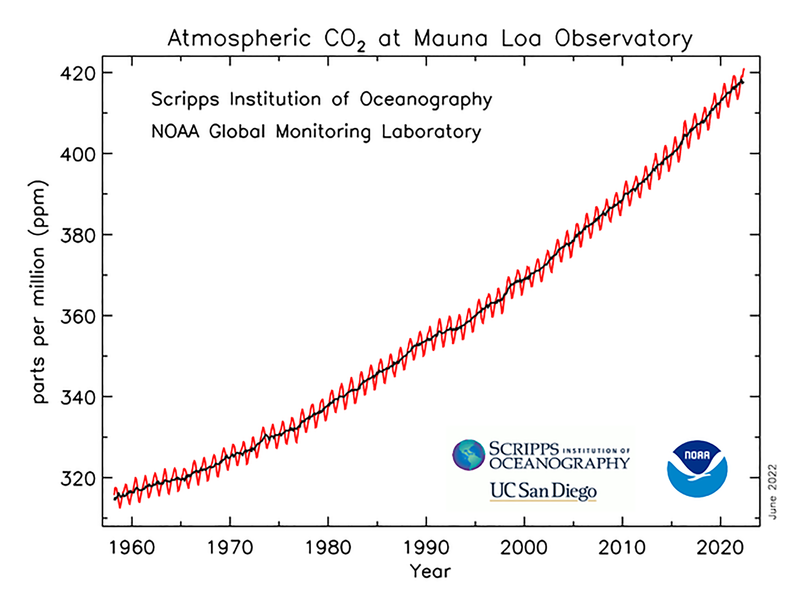

Wir sind dem Doppelten des natürlichen CO2-Gehalts der Atmosphäre näher als dem Treibhausgehalt der Atmosphäre vor der Industrialisierung. Die amerikanische [National Oceanic and Atmospheric Administration](https://www.noaa.gov/ "Homepage | National Oceanic and Atmospheric Administration") hat in einer Presseaussendung [@nationaloceanicandatmosphericadministrationCarbonDioxideNow2022] bekanntgegeben, dass der CO2-Anteil der Atmosphäre im Mai bei 421 Teilchen pro Million (ppm) lag. Bevor die Verbrennung fossiler Brennstoffe begann, waren es 280 ppm.

Eigentlich müsste das die erste Nachricht in allen Medien sein. Ich habe sie bisher nur in der Libération gefunden [@liberationNiveauCO2Jamais2022], die im wesentlichen die gute Pressemeldung der NOAA zusammenfasst. Man kann sie so interpretieren, dass die Menschheit inzwischen mehr als halb so viel CO2 produziert hat wie die Biosphäre zuvor. Tatsächlich handelt es sich aber um CO2, das in organischem Material gespeichert wurde, das wir nun verbrennen. Auch bei dieser selbstmörderischen Form der Energienutzung werden nur Möglichkeiten genutzt, die von anderen Lebewesen zur Verfügung gestellt wurden.

Die Größenordnung dieser Veränderung kann ich mir am besten klarmachen, wenn ich sie mit dem nicht menschengemachten Treibhaus-Effekt vergleiche. Ohne Treibhausgase in der Atmosphäre (CO2 ist nicht das einzige, aber das bei weitem wichtigste) wäre es auf der Erde 33° Celsius kälter [@nasaFAQWhatGreenhouse]. Dass die Durchschnittstemperatur an der Erdoberfläche nicht bei fast -20° Celsius liegt, sondern bei +15°, kommt vor allem durch die 280 ppm *natürliches* CO2 zustande. 140 ppm zusätzliches CO2 gehören also zu einer Größenordnung, die entscheidend für Leben oder Nichtleben auf einem Planeten ist. Man kann sich leicht vorstellen, wie eingreifend so viel zusätzliches CO2 den Energiehaushalt des Erdsystems verändert, wenn die doppelte Menge ausreicht zu verhindern, dass wir auf einem Eisplanet leben. 

Die NOAA-Pressemeldung weist darauf hin, dass wir eine CO2-Menge erreicht haben, die dem Pliozän, der Epoche vor 4 bis 4,5 Milliarden Jahren entspricht. Damals lag der Meeresspiegel 5 bis 25 Meter höher als heute. 

Auch wenn man naturwissenschaftliches Wissen braucht, um diese Zahlen zu interpretieren (ich habe hier nur an der Oberfläche gekratzt), handelt es sich hier um einen signifikanten Moment in einem geschichtlichen Prozess. Jede Nachrichtensendung und jede Zeitungstitelseite zeigt, dass seine Dimensionen in der Öffentlichkeit nicht verstanden werden. Noch weniger wird begriffen, dass dieser Prozess nicht unbeherrschbar und schicksalhaft abläuft.

[James Hansen](https://csas.earth.columbia.edu/about/people/james-e-hansen "James E. Hansen | Climate Science, Awareness and Solutions"), einer der Entdecker des menschengemachten Treibhauseffekts, hat in seinem letzten *Temperatzre Update* [@hansenHotterHotspotsDrier2022] eine Grafik veröffentlicht, die deutlich macht, in wie wenigen Ländern die Emissionen verursacht wurden, die zu über 420 ppm CO2 geführt haben. Die USA und Deutschland spielen eine besonders wichtige Rolle. Auch diese Grafik gehört zur Geschichtsschreibung.

Wenn man vom menschengemachten Treibhauseffekt oder von der Verantwortung eines Landes spricht, benennt man nicht die tatsächlichen historischen Akteure. Sehr spezifische Akteur-Netzwerke waren und sind die bestimmenden Faktoren für das Verbrennen fossiler Brennstoffe. [Timothy Mitchell](https://www.sipa.columbia.edu/faculty-research/faculty-directory/timothy-mitchell "Timothy Mitchell | Columbia SIPA") hat das in seinem Buch *Carbon Democracy* [-@mitchellCarbonDemocracyPolitical2011] detailliert dargestellt. Die Anreicherung der Atmosphäre mit CO2 macht aber heute die Menschheit zu einer historischen Akteurin, die durch diesen Prozess eine Gesamtgeschichte erhält. [Dipesh Chakrabarty](https://history.uchicago.edu/directory/dipesh-chakrabarty "Dipesh Chakrabarty | History | The University of Chicago") schreibt am Ende seines Aufsatzes *The Climate of History* [-@chakrabartyClimateHistoryFour2009]:

> climate change poses for us a question of a human collectivity, an us, pointing to a figure of the universal that escapes our capacity to experience the world. It is more like a universal that arises from a shared sense of a catastrophe. It calls for a global approach to politics without the myth of a global identity, for, unlike a Hegelian universal, it cannot subsume particularities. We may provisionally call it a “negative universal history.”