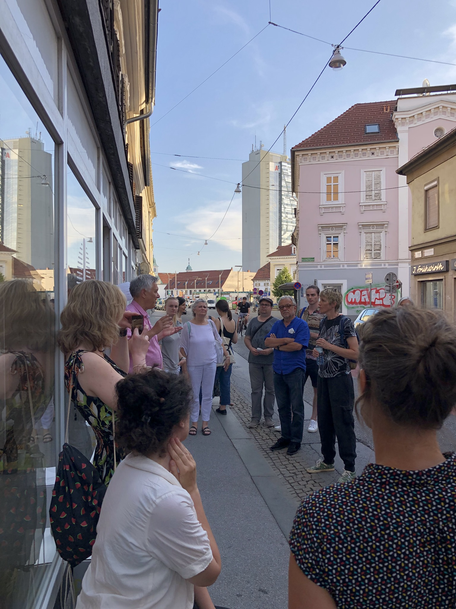
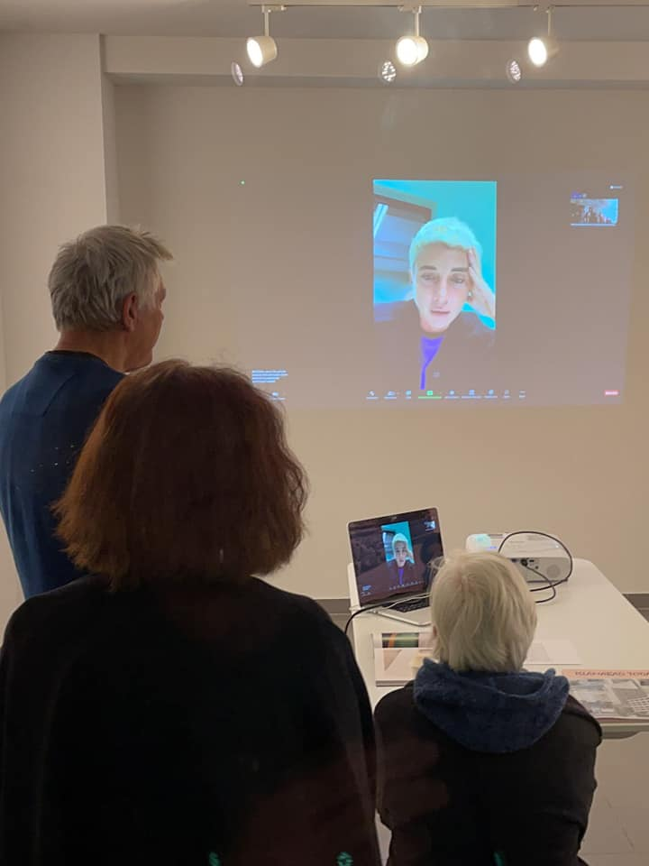
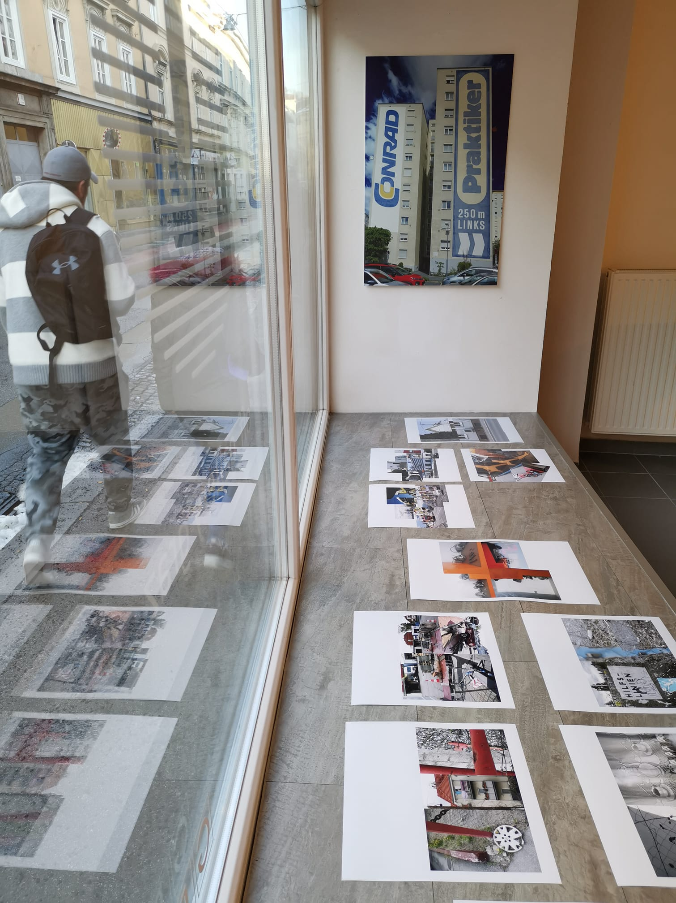

#offgallery

# off_gallery graz – Projektbericht 2021

Vernissage mit Ana Opalić (22.6.)

Artist talk mit Giovanna Silva via Zoom (23.10.)

Schaufenster der Galerie mit Collagen von Eva Mohringer-Milowiz (16.11.)

Im Jahr 2021 konnten wir die geplanten Vorhaben größtenteils realisieren, mussten dabei aber auf die Bedingungen der Pandemie Rücksicht nehmen. Deshalb haben wir mit unserem Programm erst etwas später begonnen, als wir es ursprünglich vorgesehen hatten. Außerdem haben wir mit Rücksicht auf die Pandemie auf Sichtbarkeit der Ausstellungen von außen Wert gelegt und auf Veranstaltungen mit Publikum in der Galerie außer den Vernissagen verzichtet. Wir konnten inhaltlich an das Programm der beiden Vorjahre anschließen und das Profil der Galerie schärfen. Innerhalb und außerhalb der Stadt haben wir uns weiter vernetzt, z.B. mit der Grazer und der kroatischen Fotografie-Szene.

Unser Ziel bestand weiterhin darin, ausgehend von Projekten der Autor:innenfotografien den Diskurs über Architektur, Raum und soziale Beziehungen unter den Bedingungen des Anthropozän zu fördern. Dabei stehen Recherchen zu nahegelegenen oder mit Graz vergleichbaren Regionen im Vordergrund. Wir konnten unter den nach wie vor nicht einfachen Bedingungen des Jahres 2021 die Community um die Galerie herum erhalten und sogar etwas ausbauen. Wir erreichen über soziale Medien etwa 300-400 Personen regelmäßig. 

Für 2021 hatten wir geplant, als Schwerpunkt fotografische Arbeiten ausstellen, die sich mit dem Verhältnis von Zentrum und Peripherie in Städten und Regionen auseinandersetzen, und dabei  weibliche Fotograf:innen in den Mittelpunkt zu stellen. Wie haben uns mit dem Thema Peripherie in vier Ausstellungen beschäftigt (Zita Oberwalder: *Vitrine en cours*, Ana Opalić: *Mjesta koja čekaju/Orte, die warten*, Giovanna Silva: *Souvenirs*; Eva Mohringer: *Gegenverkehr*.) In diesen Ausstellungen ging es um die Peripherie einer Megastadt (Zita Oberwalder), eine periphere und zugleich touristische Situation in Kroatien (Ana Opalić), Peripherien und städtische Zentren (Giovanna Silva) und einen Teil der urbanen Perpherie der Stadt Graz (Eva Mohringer-Milowiz). 

In allen Ausstellungen standen individuelle, autor:innen-spezifische Zugänge zu dieser Thematik im Fokus. Die Serien zeigen, wie periphere, z.T. städtische Situationen von einer Autor:in fotografisch festgehalten werden, die sie von verschiedenen gleichwertigen Punkten aus erschließt und sich auf die gebaute (oder natürliche) Umgebung konzentriert. Die Menschen, die in diesen Umgebungen wohnen, sind durch ihre weitgehende Abwesenheit präsent, sie sind nicht einfach nicht da, sondern sie fehlen oder sind ausgespart. In *Vitrine en cours* gilt das nicht nur für die Bewohnerinnen der Pariser Peripherie, sondern auch für die politischen Flüchtlinge, deren Wahrnehmung der Stadt Paris von der Fotografin einbezogen wird. Ana Opalić zeigt einen im Sommer von Touristen übervölkerten Ort, aber ohne Touristen und auch weitgehend ohne die Bewohner:innen, die ihn für den Tourismus vorbereiten und aufrechterhalten. In Giovanna Silvas Fotografien italienischer Städte fehlen wegen der Pandemie die Menschen, die dort leben oder die sie touristisch wahrnehmen, und durch die Abwesenheit von Menschen kommt es zu einer Peripherisierung sogar von dichten urbanen Zentren. Auch in Eva Mohringes Aufnahmen der Grazer Kärntnerstraße sind zwei verschiedene Gruppen nur indirekt anwesend: Bewohner:innen, die vom Verkehr verdrängt wurden, und die Verkehrsteilnehmer:innen selbst, die die Kärntnerstraße bei der Durchfahrt wahrnehmen.

Bei der fünften Ausstellung des Jahre 2021 haben wir in einem Open Call das urbane Material "Asphalt" thematisiert. Im Format haben wir damit an die Vorjahresausstellung *Everyday Graz* angeschlossen. Ca. 40 Fotograf:innnen aus Graz und der Region nahmen teil. Von einer Jury ausgewählte Arbeiten wurden gedruckt gezeigt, alle Einsendungen in einer auch von der Griesgasse aus sichtbaren durchlaufenden Projektion. 

## Lokale Präsenz

Wir konnten 2021 die Bekanntheit der Galerie in der Grazer Fotografie- und besonders in der Grazer Architekturfotografie-Szene vergößern, sowohl durch den Open Call zum Thema "Asphalt" wie durch die persönlichen Netzwerke einiger der ausgestellten Fotografinnen. Das Interesse an der Galerie als einem Ort für Diskurse über Fotografie, Stadtentwicklung und Urbanismus nahm zu. Im Griesviertel selbst waren wir leider, da Veranstaltungen pandemiebedingt kaum möglich waren, nicht so präsent, wie wir es geplant hatten.

## Internationale Vernetzung

Mit Ana Opalić aus Kroatien und Giovanna Silva aus Italien haben wir in Graz auf zwei für die Fotografie-Szene ihrer Heimatländer zentrale Fotografinnen hingewiesen und unsere Verbindungen zu diesen Ländern intensiviert. Beide Fotografinnen haben viel Fotobücher publiziert, die wir in Auswahl während der Ausstellungen gezeigt haben. Diese internationale Vermittlungsarbeit möchten wir in Zusammenarbeit mit der Kulturvermittlung Steiermark fortsetzen. 

## Autor:innenfotografie und urbane Ökologie

Wir haben uns in den Ausstellungen des Jahres 2021 in unterschiedlicher Weise mit der Wahrnehmung moderner Praktiken der  Planung, Herstellung und Nutzung urbaner und para-urbaner Umwelten durch Autor:innen in einer von ökologischen Krisen gekennzeichneten Zeit beschäftigt. Die Pandemie-Situation war auch thematisch in den Ausstellungen präsent (Zita Oberwalder, Giovanna Silva). In den Ausstellungen zum Thema Asphalt und zur Grazer Kärntnerstraße ging es auch um das Verhältnis ästhetischer Praktiken (der künstlerischen Wahrnehmung von städtischen Situationen) zur urbanistischen und planerischen Praxis und um künstlerische Fotografie als Medium sozialer Erkenntnis. Auf diesem Weg haben wir versucht, unseren Anspruch einzulösen, Fotografie als "Zugang zur sozialen Wirklichkeit des Anthropozän" zu verstehen. Darauf wollen wir in den kommenden Jahren aufbauen.

## Ausstellungen und Veranstaltungen im Jahr 2021:

**Vitrine en Cours. Paris 2020 (unfinished): Photo Essay von Zita Oberwalder in Zusammenarbeit mit Hannes Mitterberger**

12.5.2021–15.6.2021

Fotografin: Zita Oberwalder, Ausführung: Zita Oberwalder und Anastasija Georgi, Eröffnung mit Künstlergespräch während der Galerientage Graz: 12.5.2021. Finissage: 10.6.2021. Bilder Eröffnung: https://www.facebook.com/offgallerygraz/posts/1378289709238915

**Mjesta koja čekaju/Orte, die warten**

22.6.2021.-22.7.2021

Fotografin: Ana Opalić, Ausführung: Ana Opalić. Eröffnung mit Künstlergespräch: 22.6.2021
Bilder Eröffnung: https://www.facebook.com/offgallerygraz/posts/1405000569901162. Ausführliche Besprechung: https://croatian-photography.com/text/mjesta-koja-cekaju-ane-opalic-u-off-gallery-graz/ 

**Asphalt – Urbaner Grund und Hintergrund**

9.10.-22.10.2021 

Fotograf:innen: Mike Asteiner, Martina Beinhauer, Erwin Burgstaller, Andres Castiblanco-Gomez, Markus Deutsch, Xenia Drobnig, Lea Dvoršak, Nigel Gavus, Stella Gomez Castiblanco, Gertraud Enzinger, Alexander Friedl, Immanuel Fruhmann, Sylvia Fruhmann, Eva Goldgruber, Christian Happ, Ilse Hollerer, Christian Kri Kammerhofer, Max Loibl, Konstantin Leitner, Ulf Leitner, Anna Lischka, Andrea Markart, Eva Mohringer-Milowiz, Heinrich Pansi, Gernot Passath, Gemma Pepper, Simona Reisch, Alfred Resch-Diaz, Robert Sackl-Kahr, Susanne Sackl-Sharif, Marlies Schöck, Mira Silberling, Katharina Swoboda, Kia Tahmasi, Monika Tockner, Rebecca Unz, Mihael Vecchiet, Peter Wagner, Stephan Wagner, Stephan Weixler, Christopher Wittine.  Ausführung: Anastasija Georgi

Aufruf zur Teilnahme: https://www.facebook.com/offgallerygraz/posts/1454866311581254 

Einreichungen: https://offgallery.at/ausstellungen/asphalt/

Jury: Zita Oberwalder, Martin Grabner, Paolo Rosseli, Anastasija Georgi, Heinz Wittenbrink

Bilder Eröffnung: https://www.facebook.com/offgallerygraz/posts/1478933399174545 

**Souvenirs – Diptychs from Outer Space**

23.10.11.-14.11.2021

Fotografin: Giovanna Silva. Ausführung: Giovann Silva, Anastasija Georgi, Eröffnung mit Künstlergespräch (via Zoom): 23.19.2021. Bilder Eröffnung: https://www.facebook.com/offgallerygraz/posts/1486588858408999 

**Gegenverkehr – Ansichten der Kärntnerstrasse in Graz**

16.11.-12.12.2021

Fotografin: Eva Mohringer-Milowiz, Ausführung: Anastasija Georgi, Eröffnung mit Künstlergespräch: 16.11.2020. Bilder Eröffnung: https://www.facebook.com/offgallerygraz/posts/1503695606698324 

<<<<<<< Updated upstream
Online-Diskussion zur Ausstellung "Leaning from Kärntnerstraße": 30.11.2021. 

Teilnehmer:innen:  Eva Mohringer, Petra Eckhard (TU Graz),  Bernhard Inninger (Grazer Stadtplanungschef), Mark Blaschitz (Architekt und Autor). Moderation: Heinz Wittenbrink
=======
Online-Diskussion zur Ausstellung "Leaning from Kärntnerstraße": 30.11.2021. Teilnehmer:innen:  Eva Mohringer, Petra Eckhard (TU Graz),  Bernhard Inninger (Grazer Stadtplanungschef), Mark Blaschitz (Architekt und Autor). Moderation: Heinz Wittenbrink. Videoaufzeichnung: https://vimeo.com/693875920 
>>>>>>> Stashed changes

Aufzeichnung der Diskussion: https://vimeo.com/693875920

<<<<<<< Updated upstream
## Veränderungen gegenüber der Planung für 2021 ("Beilage zum Jahresprogramm 2021")
=======
## Veränderungen gegenüber der Planung für 2021 ("Beilage zum Jahresprogramm 2021"):
>>>>>>> Stashed changes

Wir mussten unser Ausstellungsprogramm modifizieren, da wir nicht in der ursprünglich beantragten Höhe gefördert wurden. Außerdem waren die geplanten Veranstaltungen in der anhaltenden Pandemiesituation nicht wie geplant durchführbar.

Die beiden Ausstellungen "Paolo Rosselli: The city/Die Stadt" und "Erika Petrić" haben wir 2021 nicht durchgeführt. Die Ausstellung zu Paolo Rosselli haben wir auf 2022 verschoben (geplanter Eröffnungstermin: 21.10.). Die Ausstellung zu Erika Erika Petrić bereiten wir gemeinsam mit dem Museum ihrer Heimatstadt Karlovac vor; dort gibt es aber noch keinen definitiven Termin. 

Den **Host Month** im Zusammenhang mit dem Verein f.act forum konnten wir im Sommer nicht durchführen, da f.act forum seine Aktivitäten neu organisiert hat und sich aus ihnen keine Ausstellung ergab. Auf Veranstaltungen für die unmittelbare Nachbarschaft in der Griesgasse haben wir wegen der Pandemie verzichtet. Stattdessen haben wir die ursprünglich nicht vorgesehene Ausstellung **Asphalt – Urbaner Grund und Hintergrund** durchgeführt, mit der wir einerseits die Grazer Fotografie- und Amateurfotografie-Szene adressiert haben und andererseits durch die Projektion der Arbeiten auch in der Griesgasse außerhalb des Galerieraums präsent sein konnten. 
